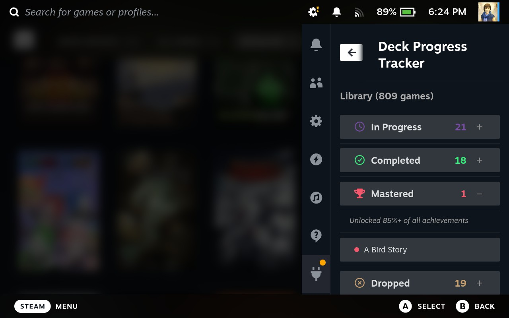
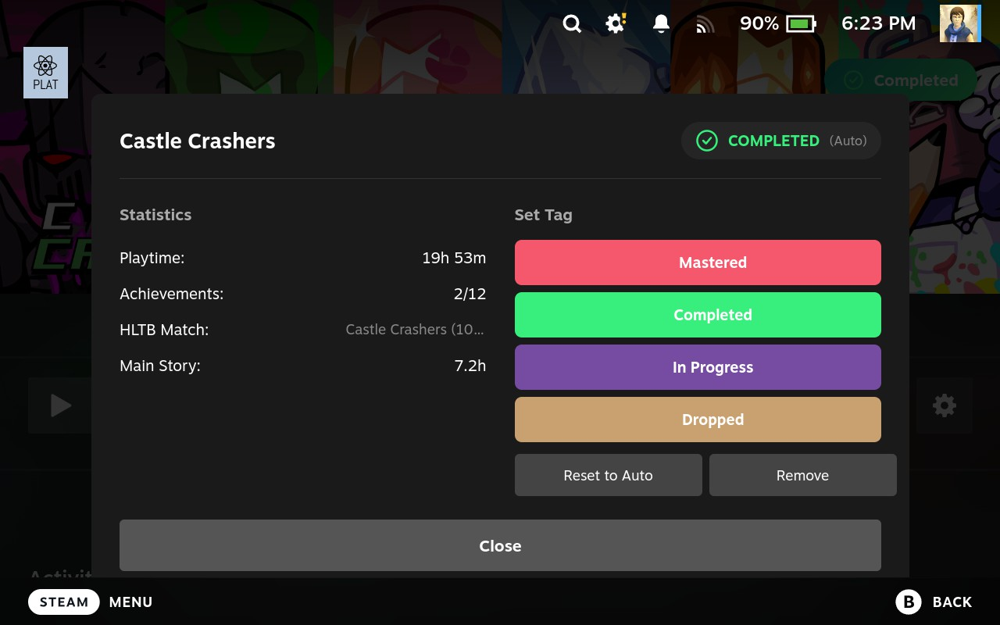

# Deck Progress Tracker

A Decky Loader plugin for Steam Deck that automatically tags your games based on achievements, playtime, and [HowLongToBeat](https://howlongtobeat.com/) data:

| Tag | Criteria |
|-----|----------|
| **Mastered** | 85%+ achievements unlocked |
| **Completed** | Playtime ≥ HLTB main story time |
| **In Progress** | Playtime ≥ 30 minutes |
| **Dropped** | Not played for over 1 year |
| **Backlog** | Not started yet |

You can also manually override any tag if the automatic detection isn't right for you.

## Screenshots

The plugin dashboard showing a library of 809 games organized by tags - In Progress (21), Completed (18), Mastered (1), and Dropped (19).

Game detail view for Castle Crashers showing statistics (playtime, achievements, HLTB data) and manual tag controls.

## Sponsor

If you find this plugin useful, consider supporting its development — it helps me keep it free, fix bugs, add new features, and stay compatible with Steam Deck updates.

## Installation

### Via URL (Recommended)

1. Open Decky Loader on your Steam Deck (QAM → Plugin icon)
2. Navigate to Settings → Developer Mode
3. Enable Developer Mode
4. Install from URL: `https://github.com/maroun2/deck-progress-tracker/releases/download/1.3.0/deck-progress-tracker-1.3.0.zip`
5. Restart Decky if prompted

### Manual Installation

1. Download the latest release from [GitHub Releases](https://github.com/maroun2/deck-progress-tracker/releases)
2. Extract to: `~/homebrew/plugins/deck-progress-tracker/`
3. Restart Decky Loader

## Tag Logic

The plugin uses a priority-based system where higher priority tags override lower ones:

### 1. Mastered (Highest Priority)
- Requires: 85%+ of all achievements unlocked
- Shows true game mastery beyond basic completion
- Priority: Overrides all other tags

### 2. Completed
- Requires: Playtime ≥ HLTB main story completion time
- Indicates you've beaten the main story
- Priority: Overrides Dropped, In Progress, Backlog

### 3. Dropped
- Requires: Game not played for 365+ days
- Only applies if not Mastered or Completed
- Automatically detected by daily background task
- Priority: Overrides In Progress, Backlog

### 4. In Progress
- Requires: Playtime ≥ 30 minutes
- Currently playing or recently played
- Priority: Overrides Backlog only

### 5. Backlog (Lowest Priority)
- No significant playtime
- Not started yet
- Default tag for games not matching other criteria

**Example**: A game with 90% achievements and 1+ year since last play will be tagged as **Mastered** (not Dropped), because Mastered has higher priority.

## Support

- **Issues:** [GitHub Issues](https://github.com/maroun2/deck-progress-tracker/issues)
- **Discord:** [Decky Loader Discord](https://deckbrew.xyz/discord)
- **Documentation:** [Decky Wiki](https://wiki.deckbrew.xyz/)

## License

MIT License - see [LICENSE](LICENSE) file

## Credits

- Built with [Decky Loader](https://github.com/SteamDeckHomebrew/decky-loader)
- Game completion data from [HowLongToBeat](https://howlongtobeat.com/)
- Python HLTB integration via [howlongtobeatpy](https://github.com/ScrappyCocco/HowLongToBeat-PythonAPI)

## Changelog

### 1.3.0 (2026-02-17)
- **New:** Dropped tag system - automatic detection of games not played for 365+ days
- **New:** Full gamepad navigation with D-pad support for all UI elements
- **New:** Universal sync progress tracking with real-time updates ("Syncing: X/Y games")
- **New:** Automated build workflow via GitHub Actions (artifacts for every commit)
- **New:** Backlog tag for games not yet started
- **Improved:** Tag priority system (Mastered → Completed → Dropped → In Progress → Backlog)
- **Improved:** UI components now use native Decky UI framework (ButtonItem, PanelSectionRow, PanelSection)
- **Improved:** Better focus highlighting for Steam Deck navigation using native focus system
- **Improved:** Centralized tag calculation logic in `calculate_auto_tag()` function
- **Improved:** In Progress threshold reduced to 30 minutes (from 60 minutes)
- **Fixed:** Dropped tag being overwritten during sync
- **Fixed:** Dropped tag being lost when viewing game detail page
- **Fixed:** State management improvements for better reliability
- **Technical:** Removed custom focus styling to use Steam's native focus system
- **Technical:** Better separation of concerns and reduced code duplication

### 1.2.0
- Enhanced UI with proper Decky components
- Improved state management
- Bug fixes and performance improvements

### 1.1.0
- Added manual tag override system
- Improved HLTB integration
- UI refinements

### 1.0.0
- Initial release
- Automatic tagging system (Completed, In Progress, Mastered)
- HLTB integration
- Basic UI
